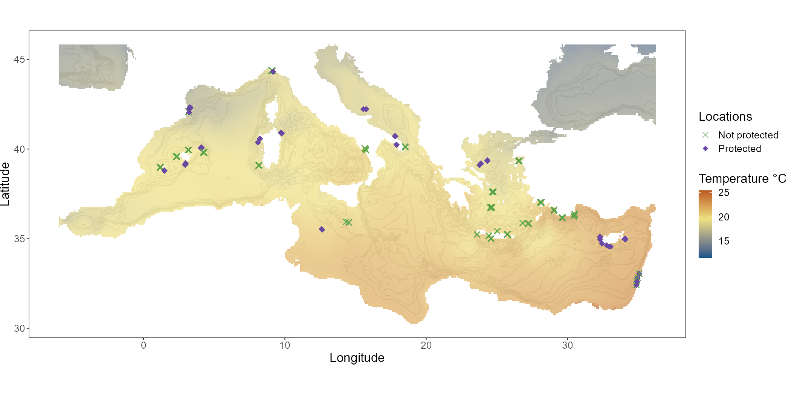

```{r setup, include=FALSE}
library(flexdashboard)
```

Methods
=======================================================================

Background {.sidebar}
------------------------------------------------------------------------

**Aim: examine species co-occurrence patterns of fish community across the Mediterranean**   

- Principally we want to know whether species co-occurrence patterns are stationary or not.  
- _Stationary_ means that they are constant across environmental gradients, i.e. if the same species pretty much always are observed together or separate.


Column 
-----------------------------------------------------------------------

### Data

- Data from all around the Mediterranean: [MEData](https://belmaker-lab.github.io/medata/)
- Three focal groups of species, each containing four species:

  1. Groupers ( _Epinephelus_ and _Serranus_ species)
  2. Seabreams ( _Diplodus_ species) 
  3. Herbivores (including invasive rabbitfish, data from East Med only)

- Environmental covariates include: temperature (SST), primary productivity, depth and MPA protection.

###

{width=400}

Column
-----------------------------------------------------------------------

### Analysis

- Co-occurrence patterns examined with the [`MRFcov` package](https://github.com/nicholasjclark/MRFcov).
- We extract the **R**elative **I**mportance (**RI**) of each of the following:

  1. All environmental covariates except MPA
  2. MPA protection
  3. Biotic associations
  4. The interaction between temperature and biotic associations
  5. The interaction between MPA protection and biotic associations

### Steps

The results I show here are after the following treatment:

1. Updated MEData with new data from Cyprus
2. Biomass was log-transfomed and scaled
3. Covariates were log-transformed and scaled
4. Ran MRF models for each group of species
5. Extracted RI


Biomass Model Results
=======================================================================

Row {data-height=2000 .tabset}
-----------------------------------------------------------------------

```{r include=FALSE}
source(here::here("R/2 models.R"))

```

### Groupers

#### 

```{r, fig.width=10}
mass_relimp$grps_mass_relimp %>% 
  plot_relimp(guild_col = "grps", guild_name = "Groupers")

```

#### 

- _E. coastae_ is mainly affected by abiotic factors.
- _E. marginatus_ is affected mainly by protection (MPA) and biotic associations.
- Both Epinephelus species are affected by the interaction between MPAs and biotic associations
- Serranus species are not affected by MPAs at all, but are quite affected by biotic associations
- _S. cabrilla_ is also affected by environmental variables.

####

```{r}
lapply(names(biomass_models$grps_mass$key_coefs), function(x)
  biomass_models$grps_mass$key_coefs[[x]] %>% 
    mutate(focal_species = x)) %>% 
  bind_rows %>% 
  mutate(focal_species = str_replace_all(focal_species, "\\.", "\\ "),
         Variable = str_replace_all(Variable, "\\.", "\\ "),
         Variable = str_replace_all(Variable, "_", "\\ x "),
         Variable = str_replace_all(Variable, "temp", "Temperature"),
         Variable = str_replace_all(Variable, "depth", "Depth"),
         Variable = str_replace_all(Variable, "prod", "Productivity"),
         Variable = str_replace_all(Variable, "mpa", "MPA")) %>%
  select("Focal species" = focal_species, Variable, RI = Rel_importance, 
         "Key coefficient" = Standardised_coef) %>% 
  formattable::formattable(align = c("l", "l", "l", "l"))

```

### Seabreams

####

```{r, fig.width=10}
mass_relimp$dip_mass_relimp %>% select(-`NA`) %>% 
  plot_relimp(guild_col = "dip", guild_name = "Seabreams")

```

####

- Diplodus species are not affected by the interaction between MPAs and biotic associations
- Only _D. annularis_ and _D. puntazzo_ are slightly affected by the interaction between temperature and biotic associations
- All species of Displodus, except _D. puntazzo_, are affected mainly by other species
- _D. puntazzo_ is more affected by the environment and protection status than by other species

####

```{r}
lapply(names(biomass_models$dip_mass$key_coefs), function(x)
  biomass_models$dip_mass$key_coefs[[x]] %>% 
    mutate(focal_species = x)) %>% 
  bind_rows %>% 
  mutate(focal_species = str_replace_all(focal_species, "\\.", "\\ "),
         Variable = str_replace_all(Variable, "\\.", "\\ "),
         Variable = str_replace_all(Variable, "_", "\\ x "),
         Variable = str_replace_all(Variable, "temp", "Temperature"),
         Variable = str_replace_all(Variable, "depth", "Depth"),
         Variable = str_replace_all(Variable, "prod", "Productivity"),
         Variable = str_replace_all(Variable, "mpa", "MPA")) %>%
  select("Focal species" = focal_species, Variable, RI = Rel_importance, 
         "Key coefficient" = Standardised_coef) %>% 
  formattable::formattable(align = c("l", "l", "l", "l"))

```

### Herbivores

####

```{r, fig.width=10}
mass_relimp$herb_mass_relimp %>% select(-`NA`) %>% 
  plot_relimp(guild_col = "herb", guild_name = "Herbivores")

```

####

- Herbivorous species are not affected by MPA status (except _Sarpa salpa_)
- The main factor affecting species distribution of herbivores is biotic associations (except _Sarpa salpa_)
- _Sarpa salpa_ is affected mainly by the interaction between other species occurrence (biotic associations) and temperature. 
- Another determinng factor for _Sarpa salpa_ is the environmental conditions, and slightly MPA. 
- Environmental conditions are playing a smaller role in other herbivorous species distribution, as in the case for the species associations and temperature interaction.

####

```{r}
lapply(names(biomass_models$herb_mass$key_coefs), function(x)
  biomass_models$herb_mass$key_coefs[[x]] %>% 
    mutate(focal_species = x)) %>% 
  bind_rows %>% 
  mutate(focal_species = str_replace_all(focal_species, "\\.", "\\ "),
         Variable = str_replace_all(Variable, "\\.", "\\ "),
         Variable = str_replace_all(Variable, "_", "\\ x "),
         Variable = str_replace_all(Variable, "temp", "Temperature"),
         Variable = str_replace_all(Variable, "depth", "Depth"),
         Variable = str_replace_all(Variable, "prod", "Productivity"),
         Variable = str_replace_all(Variable, "mpa", "MPA")) %>%
  select("Focal species" = focal_species, Variable, RI = Rel_importance, 
         "Key coefficient" = Standardised_coef) %>% 
  formattable::formattable(align = c("l", "l", "l", "l"))

```

Row
-----------------------------------------------------------------------

### Stationarity vs. Nonstationarity

```{r echo=TRUE, message=FALSE, warning=FALSE, tidy=TRUE}

lapply(all_relimp_mass, function(x){
  cov_titles <- tibble(covariate = c("env", "mpa", "bio", "temp_bio", "mpa_bio"),
                       facet.title = factor(c("Environment", "MPA", "Biotic Associations",
                                              "Temp * Biotic", "MPA * Biotic"),
                                            levels = c("Environment", "MPA", "Biotic Associations",
                                                       "Temp * Biotic", "MPA * Biotic")))
  x %>% 
    pivot_longer(2:length(.)) %>%
    rename(covariate = name, rel_imp = value) %>%
    mutate(species = str_replace_all(species, "\\.", "\\ ")) %>%
    group_by(species) %>% nest() %>% 
    mutate(new_data = map(data, function(x) right_join(x, cov_titles, by = "covariate"))) %>% 
    select(-data) %>% unnest(cols = c(new_data)) %>% replace_na(list(rel_imp = 0)) %>% 
    mutate(nonstationary = str_detect(facet.title, "\\*")) %>% 
    group_by(species, nonstationary) %>% 
    na.omit() %>% 
    summarise(sum = sum(rel_imp)) %>% 
    group_by(nonstationary) %>% 
    summarise(mean_RI = mean(sum))
})

```

Overall, groupers and seabreams (Diplodus species) are more affected by stationary factors, while non-stationary factors are affecting herbivorous species distribution to a greater extent.

Main-Effect Model Results
=======================================================================

Row {data-height=2000 .tabset}
-----------------------------------------------------------------------

```{r include=FALSE}
source(here::here("R/main_effect_model.R"))

```

### Groupers

#### 

```{r, fig.width=10}
p_relimp_grps_noint

```

####

```{r}
grps_noint_relimp %>%
  mutate(focal_species = str_replace_all(species, "\\.", "\\ ")) %>%
  select("Focal Species" = focal_species, "Environment" = env, "MPA" = mpa, "Biotic Associations" = bio) %>%
  formattable::formattable(align = c("l", "c", "c", "c"))

```

### Seabreams

####

```{r, fig.width=10}
p_relimp_dip_noint

```

####

```{r}
dip_noint_relimp %>%
  mutate(focal_species = str_replace_all(species, "\\.", "\\ ")) %>%
  select("Focal Species" = focal_species, "Environment" = env, "MPA" = mpa, "Biotic Associations" = bio) %>%
  formattable::formattable(align = c("l", "c", "c", "c"))

```

### Herbivores

####

```{r, fig.width=10}
mass_relimp$herb_mass_relimp %>% select(-`NA`) %>% 
  plot_relimp(guild_col = "herb", guild_name = "Herbivores")

```

####

```{r}
herb_noint_relimp %>%
  mutate(focal_species = str_replace_all(species, "\\.", "\\ ")) %>%
  select("Focal Species" = focal_species, "Environment" = env, "MPA" = mpa, "Biotic Associations" = bio) %>%
  formattable::formattable(align = c("l", "c", "c", "c"))

```

Abundance Models Results
=======================================================================

```{r include=FALSE}
source(here::here("R/models_abund.R"))

```

### 

```{r, , fig.height=10}
patch_plot

```


